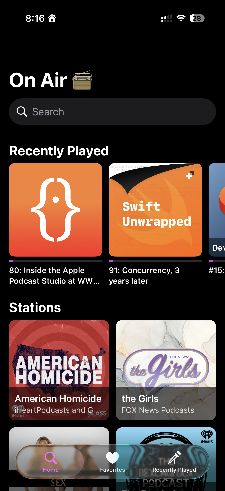
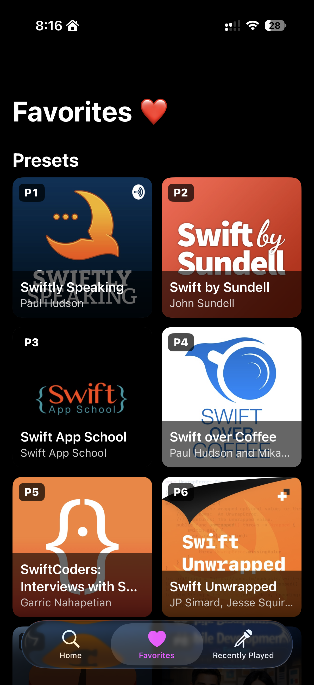
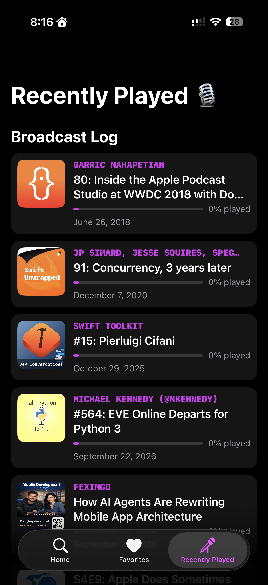
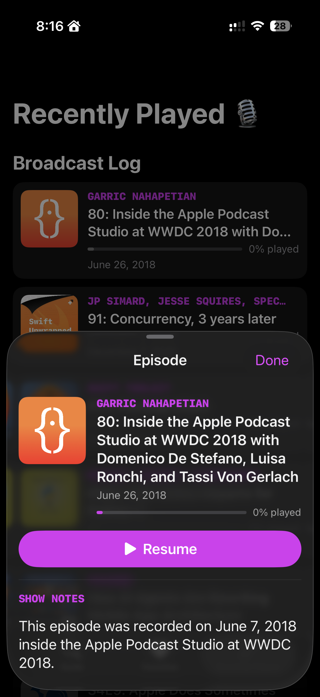
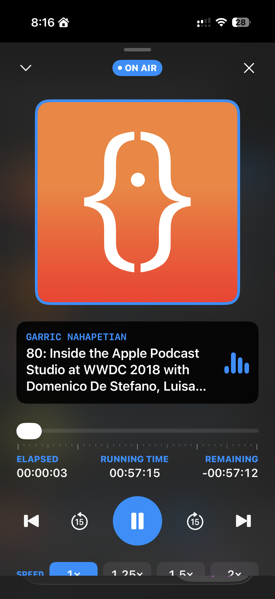
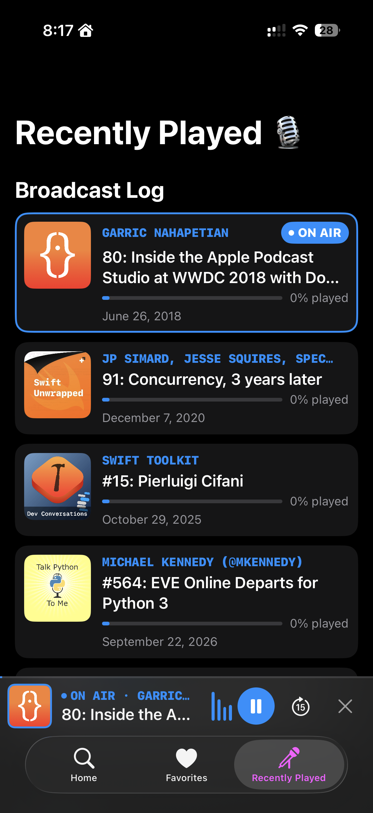

# On Air 🎙️

**Your favorite podcasts. Always within reach.**

On Air is a native podcast app for iPhone and iPad with a radio-inspired interface. Discover your next favorite show, save it as a preset, and pick up every episode right where you left off. Bold artwork, a broadcast-style player, and a persistent mini player keep the focus on what you're listening to.

<p align="center">
  
</p>

<p align="center">
  <strong>iPhone &amp; iPad · iOS 18+ · Swift · SwiftUI</strong>
</p>

## A Look Inside

<table>
  <tr>
    <th>Discover</th>
    <th>Save Your Favorites</th>
    <th>Revisit Your Listening</th>
  </tr>
  <tr>
    <td></td>
    <td></td>
    <td></td>
  </tr>
  <tr>
    <th>Explore an Episode</th>
    <th>Tune In</th>
    <th>Keep Browsing</th>
  </tr>
  <tr>
    <td></td>
    <td></td>
    <td></td>
  </tr>
</table>

## Features

- **Find your next listen.** Search for podcasts and browse trending shows, with episodes loaded directly from each show's RSS feed.
- **Build your presets.** Save favorite podcasts in a numbered grid for quick access.
- **Pick up where you left off.** A listening history and per-episode progress help you return to unfinished episodes.
- **Get the full story.** Read episode descriptions and show notes before pressing play.
- **Listen your way.** Scrub through an episode, skip forward or back 15 seconds, move between queued episodes, and choose 1×, 1.25×, 1.5×, or 2× playback.
- **Keep listening while you browse.** Switch between the expanded player and mini player, with background audio and Lock Screen controls.
- **Take episodes offline.** Download audio for later, manage downloaded episodes, and optionally restrict downloads to Wi-Fi.
- **Catch new releases.** Find new episodes from your presets on the Fresh on Air shelf and enable optional episode alerts.
- **See your listening habits.** View a listening activity heatmap and yearly statistics in Settings.

## Getting Started

You'll need a Mac with Xcode and an iOS Simulator runtime, or an iPhone or iPad running iOS 18 or later. The project uses Swift 5 language mode and Swift Package Manager for dependencies.

1. Clone the repository:

   ```sh
   git clone https://github.com/simrandotdev/Podcasts-App.git
   cd Podcasts-App
   ```

2. Open the workspace:

   ```sh
   open "OnAir-iOS/Podcasts App.xcworkspace"
   ```

3. Let Xcode resolve the Swift packages, select the **Podcasts App** scheme, and choose an iPhone or iPad simulator.
4. Press **⌘R** to build and run. To run on a physical device, configure your development team and signing in Xcode.

The workspace contains the pinned package versions. Both Debug and Release are configured to use the hosted On Air API, so a local backend isn't required for the default setup.

### Build and Test

Run these commands from `OnAir-iOS/`:

```sh
# Build for the iOS Simulator.
xcodebuild -workspace "Podcasts App.xcworkspace" -scheme "Podcasts App" \
  -destination 'generic/platform=iOS Simulator' build

# List available test destinations.
xcodebuild -workspace "Podcasts App.xcworkspace" -scheme "Podcasts App" \
  -showdestinations

# Replace SIMULATOR_UUID with an available simulator's ID.
xcodebuild -workspace "Podcasts App.xcworkspace" -scheme "Podcasts App" \
  -destination 'platform=iOS Simulator,id=SIMULATOR_UUID' test
```

The XCTest suite covers view models, playback, downloads, repositories, persistence, networking, and listening statistics.

## Under the Hood

The iOS app separates SwiftUI views and view models from business logic, repositories, and storage. Shared managers keep playback, downloads, and new-episode tracking available across screens.

| Area | Technology |
| --- | --- |
| Interface | SwiftUI |
| Audio | AVFoundation and MediaPlayer |
| Favorites and history | Core Data |
| Networking and downloads | URLSession, including background downloads |
| RSS parsing | FeedKit |
| Dependency injection | Resolver |
| Podcast discovery service | Python, FastAPI, and Podcast Index |
| Tests | XCTest for iOS; pytest for the API |

### Repository Layout

| Path | Contents |
| --- | --- |
| [OnAir-iOS/](OnAir-iOS/) | iOS app, Xcode workspace, and unit tests |
| [OnAirAPI/](OnAirAPI/) | Podcast search and trending API |
| [Docs/iOS/](Docs/iOS/) | DocC documentation, architecture guides, and diagrams |
| [Assets/](Assets/) | App screenshots and promotional assets |

### Working on the API

The FastAPI service handles podcast search and trending discovery through Podcast Index, keeping API credentials on the server. Episode feeds and audio are fetched separately by the app.

For local backend development, follow the [API setup guide](OnAirAPI/README.md). Set the iOS target's Debug `ONAIR_API_BASE_URL` build setting to your local server address, such as `http://127.0.0.1:8000` for the simulator.

## Documentation

Explore the [iOS documentation](Docs/iOS/README.md) for architecture, feature walkthroughs, storage, networking, and testing. To preview the DocC catalog locally, run this from the repository root:

```sh
xcrun docc preview Docs/iOS/OnAir.docc
```

Then open <http://localhost:8080/documentation/onair>.

## Contributing

Bug reports and focused improvements are welcome. When reporting a problem, include your device, iOS version, and steps to reproduce it. For code changes, describe the behavior being changed, run the relevant tests, and include screenshots for interface updates.
